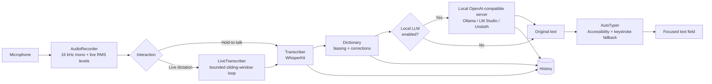

# NotchWhisper

> A free, fully-local voice-to-text app for macOS that lives in the **MacBook notch** and types your speech straight into whatever text field is focused — no cloud, no API keys, no subscriptions.

NotchWhisper runs speech recognition **on your Mac** with [WhisperKit](https://github.com/argmaxinc/WhisperKit) (Core ML Whisper). Models download on demand from Hugging Face and never leave your machine. Hold a hotkey, speak, and the words appear wherever your cursor is — Notes, Messages, your editor, a browser input, anywhere.

It's the open, local alternative to apps whose notch display is locked behind a paid plan.

[](https://www.apple.com/macos/)
[](https://www.swift.org/)
[](https://github.com/argmaxinc/WhisperKit)
[](https://github.com/ollama/ollama)

---

## Quick start

```bash
# Prerequisite: Xcode Command Line Tools (provides swiftc)
xcode-select --install

# Optional but recommended: a stable code-signing identity so macOS
# permissions survive rebuilds. Skip it and the app falls back to ad-hoc signing.
./setup_signing_identity.sh

# Build the .app (resolves WhisperKit, compiles, packages, signs)
./build.sh

# Launch
open build/NotchWhisper.app
```

On first launch the default `base` model downloads from Hugging Face (you'll see a live percentage in the notch), then the app is ready: **hold `Right ⌥`, speak, release.**

---

## Features

- **Notch display** — a FaceTime-style pill lives in the camera notch (or the menu-bar band on non-notched Macs) showing idle → recording waveform → transcribing → improving → done → error, plus a live download-percentage badge.
- **Hold-to-talk** — press and hold a global hotkey (default **Right `⌥`**) to record, release to transcribe. Works while any other app is focused.
- **Live dictation** — flip it on in Settings → General and the hotkey becomes press-on / press-off: speak and the words are typed into the focused field **in real time**, with the live transcript shown in the notch.
- **File transcription** — the **Upload** page takes any audio or video file (drop it in or pick it), decodes it locally, and transcribes the whole thing with a progress bar you can cancel. The text is editable in place, copyable, saveable as `.txt`, and saved to history like any other transcript.
- **Auto-type anywhere** — the transcript is inserted into the focused field via the Accessibility API (with a keystroke fallback) so it lands in any app.
- **Model manager** — the **Models** page is a full manager, not just a picker: it shows the active engine and its health, everything installed, what's recommended *for your Mac*, and a searchable catalog that spans the built-in models and [Hugging Face](https://huggingface.co/models). Installs are queued, resumable, pausable and verified before a model is ever activated; models can be benchmarked and compared on your own audio, tested in a playground, imported from disk, pinned to a revision, and removed with a storage view that shows exactly what each one costs.
- **Local LLM post-processing** — optionally clean up, format, rewrite, summarize, or structure your transcript with a language model running **on your Mac** (Ollama, LM Studio, Unsloth, or any OpenAI-compatible server). Your text stays local.
- **Custom dictionary** — teach the model words it keeps getting wrong, and auto-correct heard phrases ("cloud code" → "Claude Code"). Entries bias recognition *and* fix the typed output. Editable in the UI or as a plain-text file.
- **Transcript history** — every dictation is saved (raw, corrected, which dictionary fixes fired, and which LLM mode) so you can search, copy, and revisit past transcripts.
- **Six accent themes** — Ember (default), Ocean, Violet, Forest, Rose, Aqua. Recolors the whole app, the notch glow, and the Wave/Aura visualizers.
- **Five notch visualizers** — ported from LiveKit's Agents-UI: Bar, Wave, Radial, Grid, Aura.
- **Menu-bar app** — no Dock icon; everything lives in the status bar + notch, with an on-demand main window (Home, Upload, Transcripts, Dictionary, Models).

---

## Using NotchWhisper

**Hold-to-talk (default)**
1. A microphone icon appears in the menu bar. The notch pill shows **"Loading model…"** while the default (`base`) model downloads, then **"Hold `⌥` to talk"**.
2. Open **System Settings → Privacy & Security → Accessibility** and enable NotchWhisper so it can type into other apps.
3. Hold the hotkey (Right `⌥`), speak, release. The text appears wherever your cursor is.

**Live dictation**
In **Settings → General**, enable *Live dictation*. The hotkey switches to a toggle: press once to start a continuous session, speak, press again to stop. Words are typed as you talk; the notch shows the live transcript.

**Transcribing a file**
Open the main window → **Upload**, then drop in a recording (or click *Choose file…*). MP3, WAV, M4A, AAC, FLAC, AIFF, CAF, MP4 and MOV all work, at any length — the audio is decoded to 16 kHz mono on your Mac and run through the same engine, dictionary bias and correction pass as dictation. Long files show progress over the clip and can be cancelled mid-run. Nothing is auto-typed; you get the text on the page to edit, copy, or save.

**Changing the hotkey**
In **Settings → Hotkey**, click the key cap and press what you want. Three shapes are accepted:
- a bare modifier — tap `⌥` (left or right are distinct keys) and release;
- a modifier combination — hold `⌘`, tap `⌥`, release both → `⌘⌥`;
- a regular key with modifiers — hold `⌃⌥` and press Space → `⌃⌥Space`.

Escape cancels the recording; the ↺ button restores Right `⌥`. Left and right modifiers are told apart, so Right `⌥` stays free of the Option character-entry layer on the left key.

**First run details**
- The main window opens automatically the first time (when no model is downloaded yet). Afterwards the app stays invisible until you open it from the menu bar → **Open NotchWhisper**.
- WhisperKit caches models under `~/Library/Application Support/NotchWhisper/Models`.

---

## Models

NotchWhisper ships with the full `argmaxinc/whisperkit-coreml` catalog (27 variants). Pick one in **Settings → Model** or the **Models** page:

| Tier | Examples | Size | Best for |
| --- | --- | --- | --- |
| Fast | `tiny`, `tiny.en` | ~75 MB | Instant, rough text |
| Balanced | `base`, `base.en`, `small` | ~140–470 MB | Everyday multilingual dictation (default: **`base`**) |
| Accurate | `medium`, `distil-large-v3` | ~750 MB – 1.5 GB | High accuracy, 16 GB+ Macs |
| Best | `large-v3`, `large-v3 turbo` | ~947 MB – 3.1 GB | Highest accuracy; turbo ≈ 8× speed |

Larger models are more accurate but slower and heavier to download.

### The Models page

Everything about models lives on one page; Settings keeps only the behavioural
choices (which model is active, whether to pick one automatically, when to load it).

- **Active model** — what's running right now, its health, and what it costs in disk and memory.
- **Installed** — one row per model with a single primary action (`Use` / `Repair` / `Resume`), and the rest behind `•••`.
- **Recommended for your Mac** — scored against your actual hardware, your languages, your own benchmark results and your power state. Every recommendation lists the reasons that earned it.
- **Discover** — the built-in catalog plus a live Hugging Face search, with combinable filters (language, size, performance, format, runtime, source, compatibility). Only formats a shipped runtime can actually load are offered; anything else is explained rather than hidden.
- **Storage** — per-model usage, remove unused models, clear interrupted downloads, and move the model directory (copy → verify → delete, so an interrupted move never loses anything).

Accuracy and speed figures come from the model cards and are labelled as
published approximations. Anything NotchWhisper hasn't measured says
**Not benchmarked** rather than inventing a score — run the built-in benchmark
and it reports real numbers from your Mac (processing time, real-time factor,
peak memory, CPU, first-result latency, and word error rate if you supply a
reference transcript). Benchmark audio and results never leave the machine.

Downloads run through a single queue: one transfer at a time, resumable, with
byte-accurate progress, pause/cancel/retry, and a verification pass that must
succeed before a model is marked installed or made active.

### Qwen3-ASR (llama.cpp)

Apple Silicon only. The **Models** page also offers **Qwen3-ASR** — Qwen's multilingual speech model — run on the Metal GPU through a bundled build of [llama.cpp](https://github.com/ggml-org/llama.cpp) (`mtmd`). It's strong on accents, code-switching and noisy audio, and takes a short context prompt (dictionary terms as hotwords, an optional language hint).

| Model | Download | RAM |
| --- | --- | --- |
| Qwen3-ASR 0.6B (Q8) | ~0.9 GB | 8 GB+ |
| Qwen3-ASR 1.7B (Q8) | ~2.5 GB | 16 GB+ |
| Qwen3-ASR 1.7B (BF16) | ~4.7 GB | 24 GB+ |

GGUF weights download on demand from `ggml-org/Qwen3-ASR-*-GGUF` into `~/Library/Application Support/NotchWhisper/Models/llama/`. **Hold-to-talk only** — live dictation stays on WhisperKit (Qwen3-ASR has no streaming/timestamp API). The dictionary-correction and local-LLM passes run on its output unchanged.

The prebuilt llama.cpp libraries are vendored in `vendor/llama/` (pinned to a llama.cpp release; regenerate or bump with `scripts/fetch_llama.sh`). `build.sh` copies them into `NotchWhisper.app/Contents/Frameworks` and the ad-hoc/self-signed `--deep` signature covers them. For a **notarized** release each `vendor/llama` dylib must be signed with your Developer ID, the hardened runtime, and a secure timestamp before notarization.

---

## Local LLM post-processing

> Optional. Off by default. Requires a local OpenAI-compatible server (e.g. [Ollama](https://ollama.com), [LM Studio](https://lmstudio.ai), Unsloth) — nothing leaves your machine.

After a transcript is produced, NotchWhisper can send it to a model for a
processing pass before insertion. Two things set that up, both on the **AI**
page of the main window:

| Page | What it holds |
| --- | --- |
| **AI → Connections** | *Where* text is sent — any OpenAI-compatible endpoint (Ollama, LM Studio, llama.cpp, a hosted provider). Address, model name, and an optional API key stored in your login Keychain. One connection is active at a time; an app profile can pin a different one. |
| **AI → Modes** | *What* is done to it. A mode is a name, an icon, instructions in your own words, and how much latitude the model gets (Precise / Balanced / Creative). Modes that produce ONE document (a summary, a checklist) can say so, and long dictations are merged by a second pass instead of concatenated. |

**Settings → Text processing** carries the master switch and the mode that runs
by default. Picking **No processing** inserts the transcript exactly as
dictated — no AI, nothing leaves the Mac.

**Modes are yours.** There are no fixed built-in modes: six are installed on
first launch as ordinary modes you can read, edit, rename, duplicate or delete.

| Mode | What it does |
| --- | --- |
| Clean Up | Fix filler words, punctuation, and obvious mistakes while keeping your voice. |
| Markdown | Format into clean Markdown without changing the wording. |
| Rewrite | Polish spoken language into natural written prose. |
| Summarize | Condense long dictations into a concise summary. |
| Structured Notes | Organize free-form speech into sensible sections. |
| Extract Actions | Pull tasks, deadlines, and follow-ups into an actionable list. |

Upgrades keep what you had: a mode selected before this change — globally, in an
app profile, or on a shortcut — resolves to the mode that replaced it, and the
old single "Custom" instruction becomes a mode called **My instruction**.

You can switch the mode for the next dictation straight from the menu-bar item,
and override it per app (**Apps**) or per shortcut (**Shortcuts**).

**Guarantees:** the original transcription is *never* replaced by an empty or failed result — if the server errors, you keep your text and are told what happened. Long transcripts are processed in paragraph-sized chunks (never truncated).

---

## Custom dictionary

Found under the **Dictionary** tab in the main window. Two entry types:

- **Term** — a word or phrase the model should recognize (e.g. `Anthropic`). It's sent to Whisper as short biasing context so the model leans toward producing it.
- **Correction** — "when you hear X, write Y" (e.g. `cloud code` → `Claude Code`). Applied as a case-insensitive, whole-word replacement on the typed output.

Entries are also stored as a plain-text file you can edit by hand:

```text
# ~/Library/Application Support/NotchWhisper/dictionary.txt
term: Anthropic
term: Vercel
fix: cloud code -> Claude Code
```

`#` comments and blank lines are ignored. Save the file and the app reloads it automatically (the newer of `dictionary.txt` / `dictionary.json` wins). The UI warns you when a correction looks like it could clobber ordinary words.

---

## Transcript history

Every finished dictation is saved to **Transcripts** (searchable, with copy / copy-raw / delete, and clear-all or clear-matches). Each record keeps the raw engine output, the final corrected text, which dictionary fixes fired, the LLM mode used, and when it happened. The **Home** tab shows live stats (total, today, this week, word count, dictionary fixes, active model) plus your five most recent transcripts. History is capped at 500 entries and stored at `~/Library/Application Support/NotchWhisper/transcripts.json`.

---

## Appearance

**Settings → Appearance** lets you:

- Pick one of **six accent themes** — Ember (default), Ocean, Violet, Forest, Rose, Aqua. The choice recolors the entire app: sidebar, controls, notch glow, and the Wave/Aura visualizers.
- Toggle the **voice-reactive notch glow** (the island's halo breathes and heats up with your voice; off = a calm static glow).
- Choose a **notch visualizer** — Bar (default), Wave, Radial, Grid, Aura — each with a live animated preview.

---

## Settings reference

| Setting | Where | Options | Default |
| --- | --- | --- | --- |
| Live dictation | General | on / off | off |
| Launch at login | General | on / off | on |
| Theme color | Appearance | Ember / Ocean / Violet / Forest / Rose / Aqua | Ember |
| Voice-reactive glow | Appearance | on / off | on |
| Notch visualizer | Appearance | Bar / Wave / Radial / Grid / Aura | Bar |
| Hold-to-talk hotkey | Hotkey | any key, modifier, or combination | Right `⌥` |
| Active model | Model | tiny → large-v3 (+ turbo/distil/quantized) | `base` |
| Local LLM processing | Local LLM | enabled + mode (see above) | off |
| Check for updates automatically | Updates | on / off | on |

> A few behavior preferences are stored in `UserDefaults` and used by the engine — **auto-type** (on), **newline-after-text** (off), **language** (auto-detect, or any Whisper-supported language), **task** (transcribe / translate-to-English), and **haptics** (on) — but they are **not yet exposed in the Settings window**, so they currently run at their defaults.

---

## How it works



Microphone audio is resampled to 16 kHz mono (Whisper's input rate) in `AudioRecorder`, transcribed on-device by WhisperKit, optionally polished by a local LLM, and typed into the focused field by `AutoTyper`. Live dictation runs the same recognizer in a bounded sliding-window loop so latency stays flat no matter how long you speak.

### Source layout

```text
Sources/NotchWhisper/
├── main.swift            NSApplication entry point (+ --type-test / --llama-selftest / --file-selftest hooks)
├── AppDelegate.swift     Wires UI, hotkey, and the record → transcribe → type → history flow
├── AppState.swift        Observable state shared by UI + logic
├── Settings.swift        UserDefaults-backed preferences
├── AudioRecorder.swift   AVAudioEngine → 16 kHz mono + live RMS levels
├── AudioFileImport.swift Decodes a picked audio/video file to 16 kHz mono (AVAudioFile → AVAssetReader)
├── Transcriber.swift     Engine façade: WhisperKit wrapper + routes llama:* ids to LlamaASR
├── LlamaASR.swift        llama.cpp / mtmd engine for GGUF Qwen3-ASR (hold-to-talk)
├── LlamaModels.swift     Qwen3-ASR GGUF catalog (llama:* ids)
├── GGUFDownloader.swift  Resumable 2-file GGUF download from Hugging Face
├── LiveTranscriber.swift Continuous type-as-you-speak loop (WhisperKit only)
├── AutoTyper.swift       Accessibility insert + CGEvent keystroke fallback
├── HotkeyMonitor.swift   Global hotkey tap (bare modifier / combination / key + modifiers)
├── HotkeyRecorder.swift  Shortcut recorder for Settings (keyDown + flagsChanged)
├── NotchWindow.swift     Borderless always-on-top panel in the notch
├── NotchView.swift       SwiftUI pill UI (waveform, spinner, badges)
├── Visualizers.swift     5 LiveKit-style audio visualizers + settings preview
├── Models.swift          Whisper model catalog (Hugging Face ids)
├── HFModels.swift        Hugging Face search + repository metadata client
├── HFMetadataCache.swift Normalized metadata cache (stale-while-revalidate, offline-safe)
├── ModelDescriptor.swift Normalized model type + runtime registry + compatibility
├── ModelRegistry.swift   Installed-model records, lifecycle, favorites, removal
├── ModelDownloadQueue.swift Install queue over the existing downloaders (pause/resume/verify)
├── ModelStorage.swift    Storage location (+ migration), disk truth, usage report
├── ModelRecommender.swift Scoring, awards, language profile, battery awareness
├── ModelBenchmark.swift  Local benchmarking + usage analytics
├── ModelImport.swift     Import a model from disk (detect → validate → register)
├── ModelsView.swift      Models page (active / installed / recommended / discover / storage)
├── ModelDetailSheet.swift Full model detail: compatibility, capabilities, licence, files
├── ModelSheets.swift     Test playground, benchmark, compare, import, storage, downloads
├── ModelRows.swift       Model rows, cards, active panel, primary action
├── ModelsComponents.swift Status pills, metrics, banners, flow layout
├── LLMServer.swift       OpenAI-compatible chat client
├── LLMRunner.swift       Post-processing orchestration + chunking
├── LLMPrompts.swift      Per-mode system prompts
├── Dictionary.swift      Custom term / correction dictionary store
├── DictEditor.swift      Dictionary editor UI
├── History.swift         Transcript history store
├── FileTranscribeView.swift Upload page: pick/drop a file → decode → transcribe → editable text
├── MainView.swift        Main window: Home, Upload, Transcripts, Dictionary, Models
├── MenuBar.swift         Status-bar item + quick actions
├── AppVersion.swift      Build provenance read from Info.plist (commit, branch, repo)
├── UpdateChecker.swift   Polls GitHub for new commits on main + builds the changelog
├── Updater.swift         Downloads that commit, rebuilds, swaps the .app, relaunches
├── UpdateView.swift      Updates window + the "update available" banner
├── DesignTokens.swift    Theme + design system
└── Keychain.swift        Secure storage for the LLM API key
```

Two helper SwiftPM targets, `TranscribeTest` and `LiveRepro`, exercise transcription in isolation.

---

## Requirements

- macOS 14+ (built and tested on Apple Silicon)
- Xcode Command Line Tools (`xcode-select --install`) for `swiftc`
- Microphone permission (prompted on first record)
- Accessibility permission (to type into other apps)
- Input Monitoring permission (for the global hotkey; Accessibility is a reliable fallback)
- *Optional:* a local OpenAI-compatible LLM server for the [Local LLM](#local-llm-post-processing) feature

---

## Building & installing

`build.sh` resolves WhisperKit via SwiftPM, compiles a release executable, packages it as an ad-hoc- or self-signed `.app` in `build/`, and strips the *local* quarantine flag. Note: ad-hoc/self-signed builds are not trusted by Gatekeeper on other Macs — see Permissions & code signing for shipping a notarized release.

```bash
./build.sh
open build/NotchWhisper.app
```

Because the app is ad-hoc signed (no paid Developer ID), macOS may ask you to allow it the first time. Grant **Microphone** + **Accessibility** in System Settings → Privacy & Security when prompted.

> This is a script-compiled SwiftPM app (no `.xcodeproj`). Re-run `./build.sh` after any code change.

---

## Installing (build from source — no prebuilt binaries)

Prebuilt `.dmg` files are **not distributed** for now. The app is ad-hoc/self-signed, so a downloaded copy would trip Gatekeeper on other Macs (see Permissions & code signing). To run NotchWhisper, clone the repo and build it yourself:

```bash
git clone https://github.com/behkha/notchwhisper.git
cd notchwhisper
./build.sh
open build/NotchWhisper.app
```

`build.sh` accepts an `ARCH` variable (`arm64` / `x86_64` / `universal`; omit it to build for your Mac's architecture) and falls back to host arch. To package a `.dmg` for your own local use, run `./make_dmg.sh` (optionally with the arch suffix) after building.

### In-app updates

NotchWhisper follows the **`main` branch**, not tagged releases: `build.sh` stamps the commit it built from into `Info.plist` (`NWGitCommit`), and the app asks the GitHub API whether `main` has moved on. When it has, an **Update available** banner appears in the menu-bar panel and in **Settings → Updates**; opening it shows the commit range with each commit's message as the changelog.

**Update & Relaunch** then:

1. downloads that exact commit's source tarball into `~/Library/Caches/NotchWhisper/Updates` (your own checkout is never touched);
2. runs `build.sh` there — which vendors llama.cpp, compiles, and **re-signs with the same local `NotchWhisper Dev` identity**;
3. swaps the running `.app` for the result and relaunches it.

The rebuild is what keeps the app's TCC grants (Microphone, Input Monitoring, Accessibility) alive — a downloaded prebuilt binary would carry a different signature and reset every permission. In exchange, an update takes a few minutes and needs the Xcode command line tools. The build log is visible in the window while it runs, and *Skip this version* silences the banner until something newer lands.

Automatic checks run at launch and every 3 hours; turn them off in **Settings → Updates**, or check on demand from **NotchWhisper → Check for Updates…**.

**Releases.** Pushing a `v*` tag cuts a GitHub Release containing source archives only. The workflow at `.github/workflows/release.yml` is kept minimal on purpose; once Developer ID signing + notarization is wired up, it can be extended to build and attach notarized `.dmg`s again.

A **manual** run (**Actions → Release → Run workflow**) derives its release tag from the app's version (e.g. `v1.0`); you can also pass an explicit tag via the workflow's **tag** input. A tag-push run uses the pushed tag directly.

> Notes:
> - The first CI run compiles WhisperKit and its dependencies and can take 20–40+ minutes; subsequent architecture builds reuse SwiftPM's cache, so the full three-variant run is well within the 6-hour timeout.
> - Binaries are ad-hoc / self-signed, so users may need to right-click → **Open** on first launch. For a smoother install, sign with a Developer ID and notarize.
> - Models download on demand from Hugging Face, so each `.dmg` stays small.

---

## Permissions & code signing

macOS binds TCC grants (Accessibility, Input Monitoring, Microphone) to the app's **code signature**. Ad-hoc signing (`codesign -`) mints a new CDHash on every build, which silently orphans the grant: the System Settings toggle stays ON for the stale record, but the new binary is denied and prompts again on launch.

`NotchWhisper.app` avoids this by signing with a stable self-signed identity:

- `./setup_signing_identity.sh` — one-time setup; creates the **NotchWhisper Dev** code-signing certificate in the login keychain (valid 10 years).
- `./build.sh` signs with it automatically and falls back to ad-hoc with a loud warning if the identity is missing.

**Distributing the .dmg (GitHub Releases).** The self-signed "NotchWhisper Dev" identity and ad-hoc signing are local-only — they are *not* trusted by Gatekeeper on another Mac, so anyone who downloads the `.dmg` sees the "Apple could not verify … is free of malware" warning. To ship a warning-free release, sign the app with an Apple **Developer ID Application** certificate and **notarize** it: submit the built app (or `.dmg`) to Apple's notary service with `xcrun notarytool submit`, then staple the ticket with `xcrun stapler staple`. The release workflow can perform Developer ID signing + notarization automatically if you supply the certificate and notarization credentials as repository secrets.

If the permission prompt ever reappears after a rebuild:

1. `security find-identity -v -p codesigning` — confirm `NotchWhisper Dev` is listed and valid. If not, re-run `./setup_signing_identity.sh`.
2. `codesign -d -r- build/NotchWhisper.app` — the designated requirement must reference the NotchWhisper Dev cert, not plain ad-hoc.
3. If the requirement is right but access is still denied, clear the stale record once and re-grant: `tccutil reset Accessibility com.behkha.notchwhisper` (also `ListenEvent`, `PostEvent`, `Microphone`), then relaunch.

---

## Development & test hooks

NotchWhisper is a SwiftPM project (`Package.swift`), built with `./build.sh`. The repo also has two helper targets, `TranscribeTest` and `LiveRepro`, for isolated transcription testing.

Non-activating dev/test hooks (they never steal focus):

- `--wave-preview` — shows the notch pill with a simulated voice waveform so you can evaluate or screenshot the ribbon; it stays up until you quit the app.
- `--type-test "some text"` — types the text into the frontmost app via the normal AutoTyper path and exits (optional `--delay N` seconds to let the target app get focus first). An end-to-end test of dictation insertion with no UI and no microphone.
- `--file-selftest <audio-or-video-file>` — runs the Upload page's pipeline headless: decodes the file, loads the selected model, transcribes the whole clip with progress on stderr, and prints the transcript.
- `/tmp/nw_type_trigger` — a file whose contents are typed into the frontmost app ~2 s after launch; a diagnostic report is written to `/tmp/nw_typeresult.txt`.

---

## Contributing

Contributions are welcome:

1. Fork and clone the repo.
2. Create a branch (`git checkout -b my-change`).
3. Make your change, then build and run with `./build.sh`.
4. Open a pull request describing the what and why.

Please keep new behavior on-device by default and avoid introducing cloud dependencies without discussion.

---

## License

This project **does not currently ship a `LICENSE` file**. Until one is added, the default copyright (all rights reserved) applies and the code is not licensed for reuse. If you intend to use or distribute NotchWhisper, add a license or reach out to the author first.

---

## Troubleshooting

- **"Why isn't it typing?"** — Enable **Accessibility** for NotchWhisper in System Settings → Privacy & Security. Terminals (Terminal.app, iTerm, Warp) ignore Accessibility value writes, so NotchWhisper posts synthetic keystrokes there instead — that path needs **Input Monitoring** (or Accessibility) too.
- **"Apple could not verify NotchWhisper.app is free of malware" on first launch** — This is a *signing* warning, not malware. Locally built copies are signed ad-hoc (or with the local self-signed "NotchWhisper Dev" identity, which exists only on the build machine), so Gatekeeper on another Mac has no trusted signature to verify. To open it anyway: right-click the app → **Open** → click **Open** in the dialog (approves just this app), or run `xattr -dr com.apple.quarantine /Applications/NotchWhisper.app` in Terminal. For a clean, warning-free install for others, sign with an Apple **Developer ID Application** cert and **notarize** (see Permissions & code signing).
- **Hotkey doesn't fire / permission prompt reappears after a rebuild** — this is the ad-hoc signing issue above. Run `./setup_signing_identity.sh` once, rebuild, and re-grant permissions.
- **Local LLM says "can't connect"** — make sure your Ollama/LM Studio/Unsloth server is running and the **Endpoint** in Settings → Local LLM points at its `…/v1` address. Use **Test connection** to verify. Your text is sent only to that local endpoint.
- **Wrong word keeps appearing** — add it as a **Term** (to bias recognition) and/or a **Correction** (to fix the typed output) in the Dictionary tab.
- **Notch pill position with multiple displays** — it's placed on the notched (built-in) display when more than one screen is attached.
