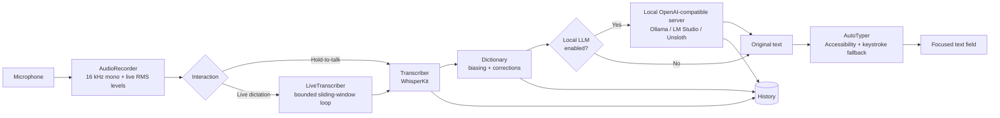

# NotchWhisper

> A free, fully-local voice-to-text app for macOS that lives in the **MacBook notch** and types your speech straight into whatever text field is focused — no cloud, no API keys, no subscriptions.

NotchWhisper runs speech recognition **on your Mac** with [WhisperKit](https://github.com/argmaxinc/WhisperKit) (Core ML Whisper). Models download on demand from Hugging Face and never leave your machine. Hold a hotkey, speak, and the words appear wherever your cursor is — Notes, Messages, your editor, a browser input, anywhere.

It's the open, local alternative to apps whose notch display is locked behind a paid plan.

[](https://www.apple.com/macos/)
[](https://www.swift.org/)
[](https://github.com/argmaxinc/WhisperKit)
[](https://github.com/ollama/ollama)

---

## Quick start

```bash
# Prerequisite: Xcode Command Line Tools (provides swiftc)
xcode-select --install

# Optional but recommended: a stable code-signing identity so macOS
# permissions survive rebuilds. Skip it and the app falls back to ad-hoc signing.
./setup_signing_identity.sh

# Build the .app (resolves WhisperKit, compiles, packages, signs)
./build.sh

# Launch
open build/NotchWhisper.app
```

On first launch the default `base` model downloads from Hugging Face (you'll see a live percentage in the notch), then the app is ready: **hold `Right ⌥`, speak, release.**

---

## Features

- **Notch display** — a FaceTime-style pill lives in the camera notch (or the menu-bar band on non-notched Macs) showing idle → recording waveform → transcribing → improving → done → error, plus a live download-percentage badge.
- **Hold-to-talk** — press and hold a global hotkey (default **Right `⌥`**) to record, release to transcribe. Works while any other app is focused.
- **Live dictation** — flip it on in Settings → General and the hotkey becomes press-on / press-off: speak and the words are typed into the focused field **in real time**, with the live transcript shown in the notch.
- **Auto-type anywhere** — the transcript is inserted into the focused field via the Accessibility API (with a keystroke fallback) so it lands in any app.
- **Local Whisper models** — pick from `tiny` → `large-v3` (incl. turbo, distil, and quantized builds) and download in-app. Cached on disk, never uploaded. The **Models** page embeds a live [Hugging Face search](https://huggingface.co/models) filtered to automatic-speech-recognition + Core ML, showing exact per-folder sizes, downloads, likes, license, and dates.
- **Local LLM post-processing** — optionally clean up, format, rewrite, summarize, or structure your transcript with a language model running **on your Mac** (Ollama, LM Studio, Unsloth, or any OpenAI-compatible server). Your text stays local.
- **Custom dictionary** — teach the model words it keeps getting wrong, and auto-correct heard phrases ("cloud code" → "Claude Code"). Entries bias recognition *and* fix the typed output. Editable in the UI or as a plain-text file.
- **Transcript history** — every dictation is saved (raw, corrected, which dictionary fixes fired, and which LLM mode) so you can search, copy, and revisit past transcripts.
- **Six accent themes** — Ember (default), Ocean, Violet, Forest, Rose, Aqua. Recolors the whole app, the notch glow, and the Wave/Aura visualizers.
- **Five notch visualizers** — ported from LiveKit's Agents-UI: Bar, Wave, Radial, Grid, Aura.
- **Menu-bar app** — no Dock icon; everything lives in the status bar + notch, with an on-demand main window (Home, Transcripts, Dictionary, Models).

---

## Using NotchWhisper

**Hold-to-talk (default)**
1. A microphone icon appears in the menu bar. The notch pill shows **"Loading model…"** while the default (`base`) model downloads, then **"Hold `⌥` to talk"**.
2. Open **System Settings → Privacy & Security → Accessibility** and enable NotchWhisper so it can type into other apps.
3. Hold the hotkey (Right `⌥`), speak, release. The text appears wherever your cursor is.

**Live dictation**
In **Settings → General**, enable *Live dictation*. The hotkey switches to a toggle: press once to start a continuous session, speak, press again to stop. Words are typed as you talk; the notch shows the live transcript.

**First run details**
- The main window opens automatically the first time (when no model is downloaded yet). Afterwards the app stays invisible until you open it from the menu bar → **Open NotchWhisper**.
- WhisperKit caches models under `~/Library/Application Support/NotchWhisper/Models`.

---

## Models

NotchWhisper ships with the full `argmaxinc/whisperkit-coreml` catalog (27 variants). Pick one in **Settings → Model** or the **Models** page:

| Tier | Examples | Size | Best for |
| --- | --- | --- | --- |
| Fast | `tiny`, `tiny.en` | ~75 MB | Instant, rough text |
| Balanced | `base`, `base.en`, `small` | ~140–470 MB | Everyday multilingual dictation (default: **`base`**) |
| Accurate | `medium`, `distil-large-v3` | ~750 MB – 1.5 GB | High accuracy, 16 GB+ Macs |
| Best | `large-v3`, `large-v3 turbo` | ~947 MB – 3.1 GB | Highest accuracy; turbo ≈ 8× speed |

Larger models are more accurate but slower and heavier to download. The **Models** page also has a live Hugging Face search (server-side filtered to ASR + Core ML repos) where every repo expands to its downloadable folders with exact sizes and metadata straight from the HF API.

---

## Local LLM post-processing

> Optional. Off by default. Requires a local OpenAI-compatible server (e.g. [Ollama](https://ollama.com), [LM Studio](https://lmstudio.ai), Unsloth) — nothing leaves your machine.

After a transcript is produced, NotchWhisper can send it to a local model for a cleanup pass before insertion. Configure it in **Settings → Local LLM**:

| Field | What it is |
| --- | --- |
| **Enable text processing** | Master switch. When off, the pipeline is exactly Voice → Transcribe → Insert. |
| **Model** | The model name served by your local app (e.g. `llama3`). |
| **Endpoint** | Base URL, e.g. `http://localhost:11434/v1` (Ollama) or `http://localhost:1234/v1` (LM Studio). Auto-normalized to `…/v1/chat/completions`. |
| **API key** | Optional; stored in your login Keychain. Leave empty when the server needs none. |
| **Processing mode** | See below. |
| **Custom instruction** | Shown when *Custom* mode is selected. |

**Processing modes**

| Mode | What it does |
| --- | --- |
| Original | Insert the transcript unchanged (no LLM call). |
| Clean Up | Fix filler words, punctuation, and obvious mistakes while keeping your voice. |
| Markdown | Format into clean Markdown without changing the wording. |
| Rewrite | Polish spoken language into natural written prose. |
| Summarize | Condense long dictations into a concise summary. |
| Structured Notes | Organize free-form speech into sensible sections. |
| Extract Actions | Pull tasks, deadlines, and follow-ups into an actionable list. |
| Custom | Apply your own instruction to the transcript. |

You can also switch the mode for a single dictation straight from the menu-bar item (**Text Processing** submenu) without opening Settings.

**Guarantees:** the original transcription is *never* replaced by an empty or failed result — if the server errors, you keep your text and are told what happened. Long transcripts are processed in paragraph-sized chunks (never truncated).

---

## Custom dictionary

Found under the **Dictionary** tab in the main window. Two entry types:

- **Term** — a word or phrase the model should recognize (e.g. `Anthropic`). It's sent to Whisper as short biasing context so the model leans toward producing it.
- **Correction** — "when you hear X, write Y" (e.g. `cloud code` → `Claude Code`). Applied as a case-insensitive, whole-word replacement on the typed output.

Entries are also stored as a plain-text file you can edit by hand:

```text
# ~/Library/Application Support/NotchWhisper/dictionary.txt
term: Anthropic
term: Vercel
fix: cloud code -> Claude Code
```

`#` comments and blank lines are ignored. Save the file and the app reloads it automatically (the newer of `dictionary.txt` / `dictionary.json` wins). The UI warns you when a correction looks like it could clobber ordinary words.

---

## Transcript history

Every finished dictation is saved to **Transcripts** (searchable, with copy / copy-raw / delete, and clear-all or clear-matches). Each record keeps the raw engine output, the final corrected text, which dictionary fixes fired, the LLM mode used, and when it happened. The **Home** tab shows live stats (total, today, this week, word count, dictionary fixes, active model) plus your five most recent transcripts. History is capped at 500 entries and stored at `~/Library/Application Support/NotchWhisper/transcripts.json`.

---

## Appearance

**Settings → Appearance** lets you:

- Pick one of **six accent themes** — Ember (default), Ocean, Violet, Forest, Rose, Aqua. The choice recolors the entire app: sidebar, controls, notch glow, and the Wave/Aura visualizers.
- Toggle the **voice-reactive notch glow** (the island's halo breathes and heats up with your voice; off = a calm static glow).
- Choose a **notch visualizer** — Bar (default), Wave, Radial, Grid, Aura — each with a live animated preview.

---

## Settings reference

| Setting | Where | Options | Default |
| --- | --- | --- | --- |
| Live dictation | General | on / off | off |
| Launch at login | General | on / off | on |
| Theme color | Appearance | Ember / Ocean / Violet / Forest / Rose / Aqua | Ember |
| Voice-reactive glow | Appearance | on / off | on |
| Notch visualizer | Appearance | Bar / Wave / Radial / Grid / Aura | Bar |
| Hold-to-talk hotkey | Hotkey | re-recordable (all modifiers) | Right `⌥` |
| Active model | Model | tiny → large-v3 (+ turbo/distil/quantized) | `base` |
| Local LLM processing | Local LLM | enabled + mode (see above) | off |

> A few behavior preferences are stored in `UserDefaults` and used by the engine — **auto-type** (on), **newline-after-text** (off), **language** (auto-detect, or any Whisper-supported language), **task** (transcribe / translate-to-English), and **haptics** (on) — but they are **not yet exposed in the Settings window**, so they currently run at their defaults.

---

## How it works



Microphone audio is resampled to 16 kHz mono (Whisper's input rate) in `AudioRecorder`, transcribed on-device by WhisperKit, optionally polished by a local LLM, and typed into the focused field by `AutoTyper`. Live dictation runs the same recognizer in a bounded sliding-window loop so latency stays flat no matter how long you speak.

### Source layout

```text
Sources/NotchWhisper/
├── main.swift            NSApplication entry point (+ --type-test hook)
├── AppDelegate.swift     Wires UI, hotkey, and the record → transcribe → type → history flow
├── AppState.swift        Observable state shared by UI + logic
├── Settings.swift        UserDefaults-backed preferences
├── AudioRecorder.swift   AVAudioEngine → 16 kHz mono + live RMS levels
├── Transcriber.swift     WhisperKit wrapper (load + download + transcribe)
├── LiveTranscriber.swift Continuous type-as-you-speak loop
├── AutoTyper.swift       Accessibility insert + CGEvent keystroke fallback
├── HotkeyMonitor.swift   Carbon global hotkey (press / release)
├── NotchWindow.swift     Borderless always-on-top panel in the notch
├── NotchView.swift       SwiftUI pill UI (waveform, spinner, badges)
├── Visualizers.swift     5 LiveKit-style audio visualizers + settings preview
├── Models.swift          Whisper model catalog (Hugging Face ids)
├── HFModels.swift        Live Hugging Face search client
├── ModelsView.swift      Models page (download + HF search)
├── LLMServer.swift       OpenAI-compatible chat client
├── LLMRunner.swift       Post-processing orchestration + chunking
├── LLMPrompts.swift      Per-mode system prompts
├── Dictionary.swift      Custom term / correction dictionary store
├── DictEditor.swift      Dictionary editor UI
├── History.swift         Transcript history store
├── MainView.swift        Main window: Home, Transcripts, Dictionary, Models
├── MenuBar.swift         Status-bar item + quick actions
├── DesignTokens.swift    Theme + design system
└── Keychain.swift        Secure storage for the LLM API key
```

Two helper SwiftPM targets, `TranscribeTest` and `LiveRepro`, exercise transcription in isolation.

---

## Requirements

- macOS 14+ (built and tested on Apple Silicon)
- Xcode Command Line Tools (`xcode-select --install`) for `swiftc`
- Microphone permission (prompted on first record)
- Accessibility permission (to type into other apps)
- Input Monitoring permission (for the global hotkey; Accessibility is a reliable fallback)
- *Optional:* a local OpenAI-compatible LLM server for the [Local LLM](#local-llm-post-processing) feature

---

## Building & installing

`build.sh` resolves WhisperKit via SwiftPM, compiles a release executable, packages it as an ad-hoc- or self-signed `.app` in `build/`, and strips the quarantine flag so it launches without Gatekeeper complaints.

```bash
./build.sh
open build/NotchWhisper.app
```

Because the app is ad-hoc signed (no paid Developer ID), macOS may ask you to allow it the first time. Grant **Microphone** + **Accessibility** in System Settings → Privacy & Security when prompted.

> This is a script-compiled SwiftPM app (no `.xcodeproj`). Re-run `./build.sh` after any code change.

---

## Releasing a .dmg (GitHub Releases)

Each release ships **three** `.dmg` files so the user can pick the one matching their Mac:

| Asset | For |
| --- | --- |
| `NotchWhisper-<version>-arm64.dmg` | Apple Silicon Macs (M1/M2/M3/M4) |
| `NotchWhisper-<version>-x86_64.dmg` | Intel Macs |
| `NotchWhisper-<version>-universal.dmg` | Either — contains both slices in one binary |

`build.sh` accepts an `ARCH` variable (`arm64` / `x86_64` / `universal`, or unset for host arch) and `make_dmg.sh` takes the matching suffix to name the disk image.

**Locally (build one at a time)**

Build and package each variant separately — `build.sh` overwrites `build/NotchWhisper.app`, so create the `.dmg` immediately after each build:

```bash
ARCH=arm64 ./build.sh && ./make_dmg.sh arm64         # -> NotchWhisper-<version>-arm64.dmg
ARCH=x86_64 ./build.sh && ./make_dmg.sh x86_64       # -> NotchWhisper-<version>-x86_64.dmg
ARCH=universal ./build.sh && ./make_dmg.sh universal  # -> NotchWhisper-<version>-universal.dmg
```

(Legacy form `UNIVERSAL=1 ./build.sh` is still accepted and equals `ARCH=universal`.)

**Via GitHub Actions (automatic)**

Push a version tag (or run the workflow manually) and a single macOS runner builds all three variants and attaches them to one GitHub Release:

```bash
git tag v1.0.0
git push origin v1.0.0
```

The workflow lives at `.github/workflows/release.yml` and uses only Apple-native tools — no extra dependencies. The Apple Silicon runner cross-compiles the Intel slice, so no second machine is required.

> Notes:
> - The first CI run compiles WhisperKit and its dependencies and can take 20–40+ minutes; subsequent architecture builds reuse SwiftPM's cache, so the full three-variant run is well within the 6-hour timeout.
> - Binaries are ad-hoc / self-signed, so users may need to right-click → **Open** on first launch. For a smoother install, sign with a Developer ID and notarize.
> - Models download on demand from Hugging Face, so each `.dmg` stays small.

---

## Permissions & code signing

macOS binds TCC grants (Accessibility, Input Monitoring, Microphone) to the app's **code signature**. Ad-hoc signing (`codesign -`) mints a new CDHash on every build, which silently orphans the grant: the System Settings toggle stays ON for the stale record, but the new binary is denied and prompts again on launch.

`NotchWhisper.app` avoids this by signing with a stable self-signed identity:

- `./setup_signing_identity.sh` — one-time setup; creates the **NotchWhisper Dev** code-signing certificate in the login keychain (valid 10 years).
- `./build.sh` signs with it automatically and falls back to ad-hoc with a loud warning if the identity is missing.

If the permission prompt ever reappears after a rebuild:

1. `security find-identity -v -p codesigning` — confirm `NotchWhisper Dev` is listed and valid. If not, re-run `./setup_signing_identity.sh`.
2. `codesign -d -r- build/NotchWhisper.app` — the designated requirement must reference the NotchWhisper Dev cert, not plain ad-hoc.
3. If the requirement is right but access is still denied, clear the stale record once and re-grant: `tccutil reset Accessibility com.behkha.notchwhisper` (also `ListenEvent`, `PostEvent`, `Microphone`), then relaunch.

---

## Development & test hooks

NotchWhisper is a SwiftPM project (`Package.swift`), built with `./build.sh`. The repo also has two helper targets, `TranscribeTest` and `LiveRepro`, for isolated transcription testing.

Non-activating dev/test hooks (they never steal focus):

- `--wave-preview` — shows the notch pill with a simulated voice waveform so you can evaluate or screenshot the ribbon; it stays up until you quit the app.
- `--type-test "some text"` — types the text into the frontmost app via the normal AutoTyper path and exits (optional `--delay N` seconds to let the target app get focus first). An end-to-end test of dictation insertion with no UI and no microphone.
- `/tmp/nw_type_trigger` — a file whose contents are typed into the frontmost app ~2 s after launch; a diagnostic report is written to `/tmp/nw_typeresult.txt`.

---

## Contributing

Contributions are welcome:

1. Fork and clone the repo.
2. Create a branch (`git checkout -b my-change`).
3. Make your change, then build and run with `./build.sh`.
4. Open a pull request describing the what and why.

Please keep new behavior on-device by default and avoid introducing cloud dependencies without discussion.

---

## License

This project **does not currently ship a `LICENSE` file**. Until one is added, the default copyright (all rights reserved) applies and the code is not licensed for reuse. If you intend to use or distribute NotchWhisper, add a license or reach out to the author first.

---

## Troubleshooting

- **"Why isn't it typing?"** — Enable **Accessibility** for NotchWhisper in System Settings → Privacy & Security. Terminals (Terminal.app, iTerm, Warp) ignore Accessibility value writes, so NotchWhisper posts synthetic keystrokes there instead — that path needs **Input Monitoring** (or Accessibility) too.
- **Hotkey doesn't fire / permission prompt reappears after a rebuild** — this is the ad-hoc signing issue above. Run `./setup_signing_identity.sh` once, rebuild, and re-grant permissions.
- **Local LLM says "can't connect"** — make sure your Ollama/LM Studio/Unsloth server is running and the **Endpoint** in Settings → Local LLM points at its `…/v1` address. Use **Test connection** to verify. Your text is sent only to that local endpoint.
- **Wrong word keeps appearing** — add it as a **Term** (to bias recognition) and/or a **Correction** (to fix the typed output) in the Dictionary tab.
- **Notch pill position with multiple displays** — it's placed on the notched (built-in) display when more than one screen is attached.
